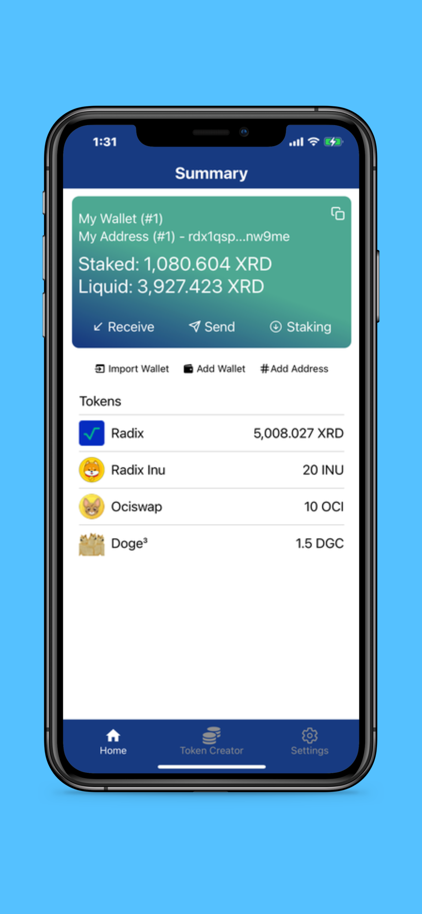
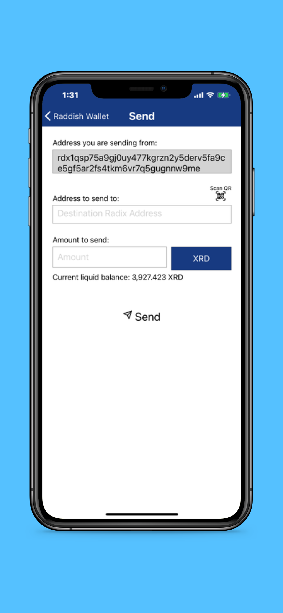
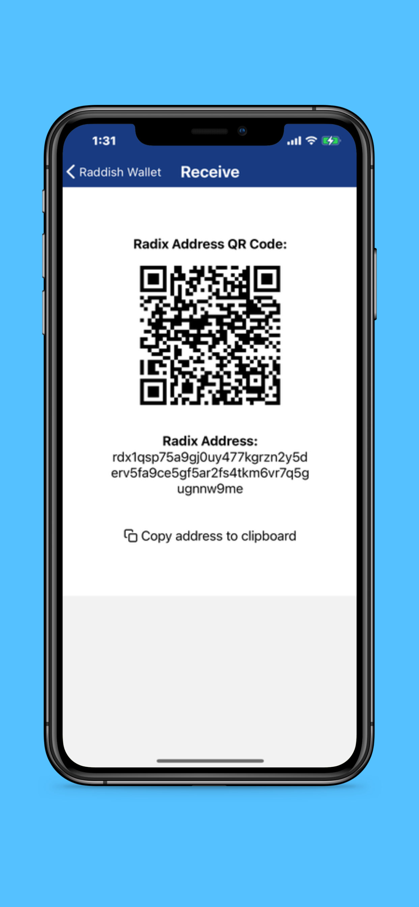
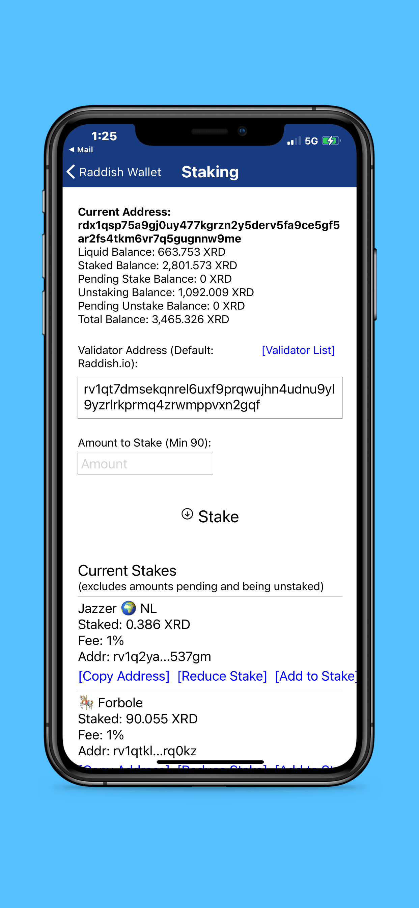
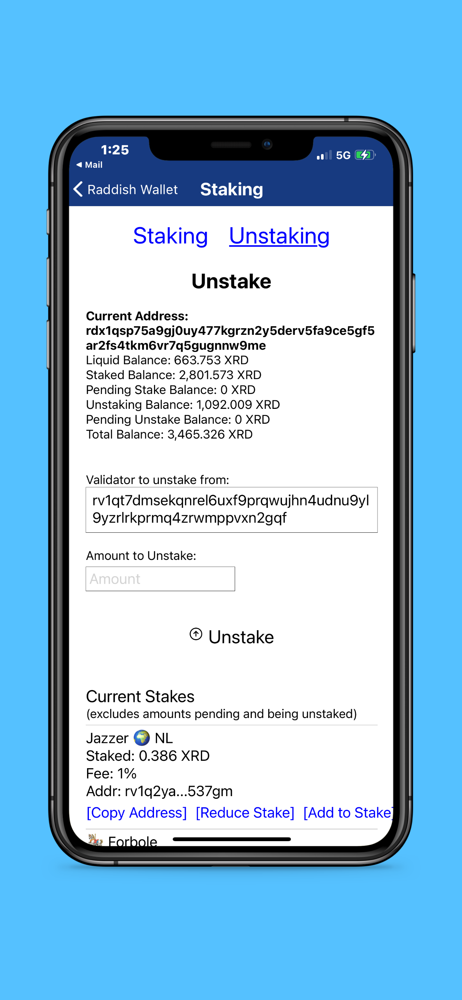
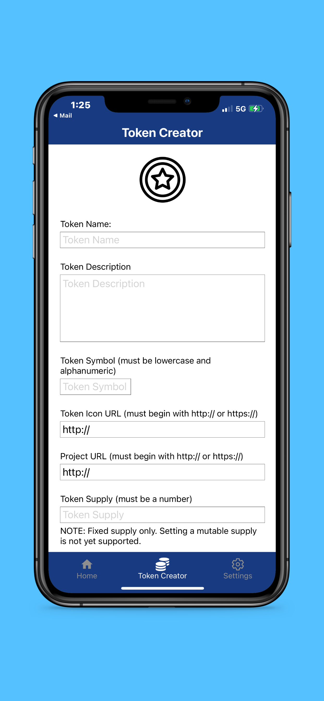
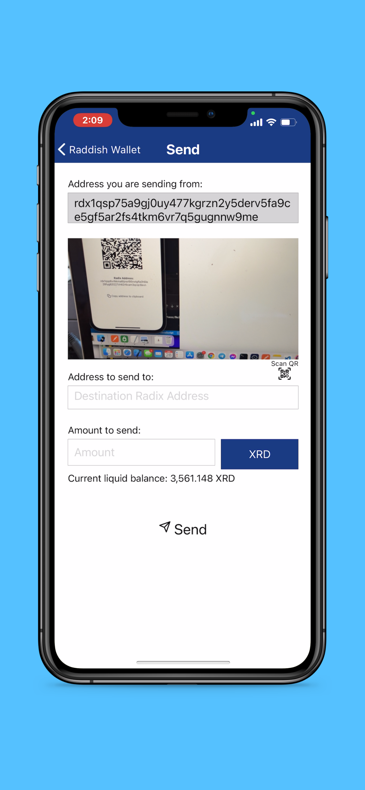

# Radbag iOS Mobile Wallet for Radix DLT

<p align="center">

</p>
Introducing the Radbag Wallet! Radbag Wallet is the *first* iOS and Android mobile wallet for the Radix DLT ecosystem!

Features of this wallet include:

- Wallet creation and imports
- Multi-wallet, multi-address support
- Ability to display, send, and receive XRD or any other tokens
- QR Code reader for receiving payments
- Ability to stake or unstake XRD to/from any validator
- Ability to create new tokens 

<p float="left">
  
   
  
  
   
  
  
</p>

## Typical App Installation

This app can be downloaded and installed on an iPhone from the Apple App Store using the link below. 
</br>
</br>
<b>NOTE: </b>Due to dependence on certain cryptographic libraries, only iOS v.13.0 and above is supported!:
</br>
</br>
<p align="center">
<a href="https://apps.apple.com/us/app/raddish-wallet/id1608033916"></a>
</p>

Also available on Android:
<a href="https://play.google.com/store/apps/details?id=com.raddishwallet&hl=en_US&gl=US"></a>

## Installation for Development Purposes

This app was created using React Native. Although React Native can be used to create both iOS and Android apps, currently only the iOS React Native app is working.

More detailed installation instructions are to come. For now, if you already have at least XCode v12.0, node.js v16.5.0, and npm v7.19.1 installed, go into the Raddish Wallet home directory and run:

```bash
npm install
```
Then go into the $PROJECT_HOME/ios directory and run:
```bash
pod install
```

Then, go back to the project home directory and run the following to start the iPhone/iOS Simulator:

```bash
npx react-native run-ios  
```


## Contributing
Pull requests are welcome. For major changes, please open an issue first to discuss what you would like to change.

## License
[MIT](https://choosealicense.com/licenses/mit/)
